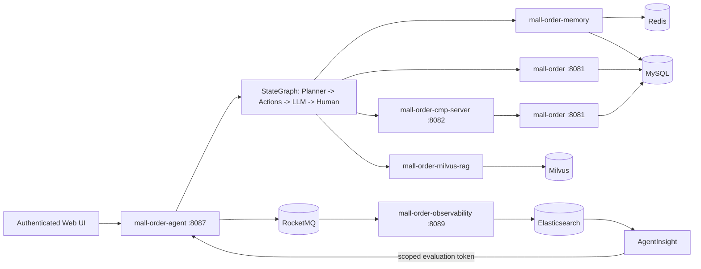

# E-commerce Order Agent Platform

一个面向电商订单场景的可观测 AI Agent：使用 Spring AI Alibaba StateGraph 编排规划、记忆、RAG、订单工具和人工确认，并把完整执行轨迹异步写入 Elasticsearch，供 AgentInsight 做质量评测。

> 项目定位：不是通用聊天机器人，而是一条可解释、可回归、可人工接管的订单 Agent 执行链。

## 项目演进

本项目由 `EcommSpringBot` 持续重构而来，不是一次性创建的新仓库。原型阶段的 18 个提交完整保留在当前 Git 历史中，重构前基线标记为 `ecommspringbot-v1`；后续提交记录从实验型商城助手收敛为可验证的订单 Agent 平台。

| 演进维度 | EcommSpringBot 原型 | 当前平台 |
| --- | --- | --- |
| 模块边界 | 多个独立实验模块和重复 Wrapper | 订单、MCP、Observability、RAG、Memory、Agent 六个核心模块 |
| Agent 编排 | Function Calling 与早期 StateGraph 实验 | 确定性 Planner、动作链、Graph checkpoint、人工中断与恢复 |
| 业务安全 | 主要验证自然语言订单操作 | 服务端身份、能力边界、订单归属、敏感操作确认和安全审计 |
| RAG 与记忆 | 独立服务原型 | 作为 Agent 依赖组合，统一权限范围和 Trace 契约 |
| 质量闭环 | 以接口和日志验证为主 | 单元/集成测试、端到端 smoke、RocketMQ + Elasticsearch Trace、AgentInsight 评测 |
| 交付方式 | 子模块分别启动 | 根 Reactor、Docker Compose、统一脚本和 CI |

可以使用以下命令审查演进过程，而不只查看最终代码：

```bash
git log --oneline --decorate --graph --all
git diff ecommspringbot-v1..HEAD --stat
```

## 核心能力

- **确定性规划**：按问题路由到订单查询、RAG 问答、记忆或敏感订单操作。
- **Human-in-the-Loop**：退款、退货、换货、取消订单和改址必须先中断，用户确认后才恢复 Graph。
- **真实业务闭环**：售后操作通过 MCP 调用订单服务并写入 `after_sales_request`，不是模拟成功文本。
- **确定性退款资格**：订单服务依据实时订单、物流、履约和商品类型输出四态结论；RAG 与大模型只能解释，不能改写结论。
- **登录与权限工作区**：HR、研发、销售和客户共 8 个演示账户，身份、知识范围、订单范围和工具能力均由登录会话决定。
- **订单归属边界**：客户端不能指定 `actorUserId`；客户只能看本人订单，销售只能看被分配客户且电话、地址脱敏。
- **混合记忆**：Redis 保存短期会话，Milvus 保存长期语义记忆，MySQL 保存结构化用户画像。
- **RAG 证据链**：内置 8 份演示 PDF，支持服务端派生的 metadata 范围过滤、向量召回、rerank 和引用证据 Trace。
- **异步可观测性**：Trace 经 RocketMQ 写入 Elasticsearch，根事件、检索、LLM、Tool 和人工确认均可追踪。
- **可重复验证**：默认 `verify` 不依赖本地端口或外部基础设施，另有 3 条端到端 smoke 场景。

## 架构



## 六个核心模块

| 模块 | 责任 | 运行方式 |
| --- | --- | --- |
| `mall-order` | 订单查询、归属校验、退款资格计算、取消订单、售后工单落库 | 独立服务，`8081` |
| `mall-order-cmp-server` | 将敏感订单操作封装为 MCP Tools | 独立服务，`8082` |
| `mall-order-observability` | Trace 发布、消费、ES 索引与查询 | 独立服务，`8089` |
| `mall-order-milvus-rag` | PDF 导入、Milvus 检索、rerank、RAG | 嵌入 Agent |
| `mall-order-memory` | Redis 短期记忆、Milvus 长期记忆、用户画像 | 嵌入 Agent |
| `mall-order-agent` | Planner、StateGraph、LLM、Tool、人工确认和 Web UI | 独立服务，`8087` |

RAG、Memory 和 Observability 的生产端以库形式组合进 Agent；实际需要启动的应用进程是订单服务、MCP 服务、Trace 消费服务和 Agent，共 4 个。构建后四个进程均以可执行 JAR 启动，Observability 同时保留普通 JAR 供 RAG/Agent 复用。

## 快速启动

### 环境要求

- JDK 17+
- Docker Desktop / Docker Compose
- `jq`、`curl`、`nc`
- 可用的 DashScope API Key

### 1. 配置环境变量

```bash
cp .env.example .env
```

在 `.env` 中填写 `DASHSCOPE_API_KEY`。本地演示默认密码为 `DemoLogin@2026!`；如需管理员工作台，还需设置至少 12 位的 `ADMIN_INITIAL_PASSWORD`。服务凭据已有仅供回环地址演示的默认值，非本地环境必须全部替换。`.env` 已被 Git 忽略。

### 2. 启动基础设施

```bash
./scripts/setup-local-mysql.sh
./scripts/dev-up.sh
```

第一个脚本使用本机 `3306` 端口的 MySQL，安全提示输入管理员密码，并幂等创建两套 schema、`portfolio` 本地开发账号和 3 条虚构订单。第二个脚本通过 Compose 启动 Redis、Milvus（含 etcd/MinIO）、RocketMQ 和 Elasticsearch，并检查包括本机 MySQL 在内的全部依赖端口。Docker 服务默认使用 `16379/29530/19876/19200` 等隔离端口，避免与常见本地开发服务冲突。

### 3. 启动四个应用进程

这里的“四个应用进程”是 `start-apps.sh` 实际启动的以下服务：

| 启动顺序 | 应用 | 默认端口 | 作用 |
| --- | --- | --- | --- |
| 1 | `mall-order` | `8081` | 提供订单查询、取消订单和售后工单等业务接口 |
| 2 | `mall-order-cmp-server` | `8082` | 通过 MCP 暴露订单操作工具，并调用 `mall-order` |
| 3 | `mall-order-observability` | `8089` | 消费 RocketMQ 中的 Trace 事件并写入 Elasticsearch |
| 4 | `mall-order-agent` | `8087` | 提供 Web UI 和 Agent API，编排 RAG、Memory、LLM 与订单工具 |

`mall-order-milvus-rag` 和 `mall-order-memory` 作为依赖嵌入 `mall-order-agent`，不需要在这一步单独启动。脚本会按上表顺序构建并启动应用，并在启动下一个应用前检查当前应用是否就绪。

```bash
./scripts/start-apps.sh
```

脚本默认设置 `SPRING_PROFILES_ACTIVE=demo`。在 IDEA 中可直接运行 `All Applications` Compound；如果 Observability 已经运行，可运行只包含订单、MCP 和 Agent 的 `Core Applications`。四个子配置均启用 `demo` profile。

启动完成后打开 [http://127.0.0.1:8087](http://127.0.0.1:8087)。应用日志位于 `logs/`，PID 位于 `run/`。脚本在安装了 `screen` 的环境中使用独立后台会话托管进程，终端退出后服务仍会运行；其他环境回退到 `nohup`。

### 4. 初始化演示知识库

```bash
./scripts/demo-setup.sh
```

该命令把 `mall-order-milvus-rag/src/main/resources/data` 中的 8 份 PDF 切分、通过 DashScope 嵌入模型向量化并写入 Milvus。文档和 Chunk 使用稳定 ID，因此脚本可以重复执行。执行意味着 PDF 提取文本会发送给外部模型服务，请仅导入允许外发的数据。

## 退款资格模型

`orders.order_status` 保持五态：`0待付款、1已付款、2已发货、3已完成、4已取消`；物流事实独立保存在 `delivery_status`（`0未发货、1运输中、2已签收、3已拒收`）和 `signed_at`，避免把“已完成”误当成签收时间。定制和虚拟商品分别使用生产、数字交付字段记录履约状态。`order_details.product_type` 为 `0普通、1定制、2生鲜、3虚拟`，当前退款资格按整单同一类型判断。

`POST /orders/{orderId}/refund-eligibility` 返回 `ELIGIBLE / INELIGIBLE / NEED_MORE_INFO / MANUAL_REVIEW`、原因编码、缺失字段、下一步动作和规则版本。已付款未发货的普通商品可直接申请退款，不再追问签收、签收日期或拆封状态；只有已签收的普通商品无理由退货，才检查签收后 7 天和商品是否影响二次销售。售后提交会在事务内重新计算资格，并通过活动工单业务键保证重复提交幂等。

## 登录与演示账户

浏览器只提交用户名和密码，业务身份来自服务端登录会话。普通用户不能切换身份，也不能通过请求体扩大 RAG 或订单范围。登录失败 5 次锁定 15 分钟；会话空闲 30 分钟、最长 8 小时，同一账户只保留一个有效会话。

| 类别 | 登录名 / 业务身份 | 知识范围 | 订单与工具能力 |
| --- | --- | --- | --- |
| HR | `hr.linyue / HR001`、`hr.chenchen / HR002` | `public + hr` | 仅知识检索 |
| 研发 | `dev.zhouhang / DEV001` | `public + developer` | 仅知识检索 |
| 研发 | `dev.zhaoning / DEV002` | `public + developer + admin` | 技术与 Agent 运维知识 |
| 销售 | `sales.wanglei / SALES001` | `public + sales` | 仅查看已分配的 `USER1001` 订单，隐私字段脱敏 |
| 销售 | `sales.liuting / SALES002` | `public + sales` | 仅查看已分配的 `USER1002` 订单，隐私字段脱敏 |
| 客户 | `customer.zhangwei / USER1001` | `public + customer_service` | 本人两笔订单、取消与售后确认 |
| 客户 | `customer.lina / USER1002` | `public + customer_service` | 本人一笔已完成订单、取消与售后确认 |

身份目录、账号、知识范围、能力、推荐问题和销售客户分配由 Flyway 与 `demo` profile 初始化。动态用户画像仍保存在原有 `user_profile` 表。管理员可在 demo 环境中经密码复核短时代入业务身份，最长 15 分钟，代入期间不能执行管理命令或确认敏感操作。

### 重置演示

演示重置、知识库写入、账户、令牌与安全审计接口均仅向管理员开放，可在管理员工作台操作。

重置会恢复 3 笔示例订单的原始状态，删除示例售后单，并清空 8 个身份的 Redis 短期记忆、Milvus 长期记忆、动态用户画像和待确认状态。Persona、知识范围、销售分配和已导入的知识库不会被删除。`mall-order` 的内部重置接口只在 `demo` profile 下存在。

### 5. 运行端到端场景

```bash
./scripts/smoke-test.sh
```

脚本验证：

1. `ORDER_QUERY`：查询 `USER1001` 的 `ORD20260810001`。
2. `RAG_QA`：回答退款规则且必须有知识库命中。
3. `DANGEROUS_ORDER_OP`：退款请求必须中断并等待确认。

同时验证确认后真实落库：

```bash
CONFIRM_SENSITIVE=true ./scripts/smoke-test.sh
```

### 停止

```bash
./scripts/stop-apps.sh
./scripts/dev-down.sh
```

`dev-down.sh` 保留数据卷，便于重复演示。

## 构建与测试

```bash
./mvnw verify
./mvnw -pl mall-order-agent -am verify
```

默认测试只使用纯单元测试、MockMvc 和 mock 客户端，不会连接 MySQL、Redis、Milvus、DashScope 或固定的 `localhost` 服务。需要真实环境的测试以 `*LiveIT` / `*IntegrationTest` 命名，并从默认 Surefire 集中排除。

CI 定义见 `.github/workflows/ci.yml`，会校验 Compose 配置并执行全 Reactor `verify`。

## Trace Contract 1.0

根 Trace 使用 `agent.ask` 或 `agent.resume`，并在 `TRACE_END` 保留评测所需的稳定字段：

| 字段 | 含义 |
| --- | --- |
| `traceSchemaVersion` | 契约版本，当前为 `1.0` |
| `agentName` / `agentVersion` | Agent 标识与版本 |
| `conversationId` | 业务会话 ID |
| `queryFingerprint` / `queryLength` | 不记录原文的输入标识 |
| `planStrategy` | Planner 的最终策略 |
| `grounded` / `interrupted` | 证据状态与人工中断状态 |
| `responseLength` | 输出长度，不采集输出原文 |
| `continuedFromTraceId` | `resume` 与原中断 Trace 的关联 |

检索 Span 记录 `chunkId`、`source` 和 `score`，敏感 Tool Span 记录 `operation`、订单/用户指纹与 `executionStatus`。问题、回答、Prompt、订单号、用户 ID 和过滤表达式原文均不进入 Trace。RocketMQ 消费失败会抛出异常触发重试，避免失败消息被静默确认。

## 安全范围

- Web 使用 Spring Security、BCrypt 12、Redis 服务端会话、CSRF、会话固定防护、单会话限制和登录锁定。
- `actorUserId`、RAG scope、capability 与订单客户范围全部由认证主体派生；跨用户 `resume/abandon` 返回 404。
- 订单、MCP 和观测接口使用独立服务凭据；健康探测保持公开且所有端口默认仅绑定 `127.0.0.1`。
- AgentInsight 使用专用 `EVALUATION_ACT_AS` 令牌调用 `/internal/evaluation/ask`，令牌只存 SHA-256 摘要并支持撤销。
- 登录、账户、密码、令牌、代入和拒绝事件写入脱敏安全审计，保留 180 天。
- Trace 不采集问题、回答、Prompt、订单号或完整用户 ID 原文。

公网部署仍需接入 TLS、正式 secret manager、外部 IdP/MFA、集中网关限流和多实例 checkpoint；仓库中的 `local-*-change-me` 默认凭据只能用于回环地址演示。

## 与 AgentInsight 联动

关联仓库：[AgentInsight](https://github.com/lydiayan/agent-insight)

E-commerce Order Agent Platform 负责执行，AgentInsight 负责观测和评测。两者连接同一个 Elasticsearch `rag-traces` 索引后，AgentInsight 可以按 `agent.ask / TRACE_END` 统计质量，并根据 Planner、RAG、Tool、Human Span 做确定性回归。

两边必须配置相同的 `AGENT_EVALUATION_TOKEN`。AgentInsight 的历史用例会由 V9 自动迁移到 `http://127.0.0.1:8087/internal/evaluation/ask`，不会使用网页登录会话或客户端身份字段。

建议面试演示顺序：

1. 展示普通订单查询如何绕过 LLM，直接走确定性 Tool。
2. 展示 RAG 问答的召回证据、rerank 和 Trace。
3. 发起退款，展示 Graph 中断；确认后展示 MCP 调用与 MySQL 工单。
4. 在 AgentInsight 中打开同一 `traceId`，解释为何能定位规划、召回或工具问题。

## 已知边界

- Graph checkpoint 和待确认状态当前保存在单进程内存中，不支持多实例或重启恢复。
- 知识库导入是显式运维步骤；同一版本可幂等导入，修改文档内容后应规划旧版本清理策略。
- Compose 面向本地开发，不包含生产级高可用、TLS、备份和容量规划。
- 端到端 smoke 依赖 DashScope 网络和 API 配额，默认单元测试不依赖它们。
