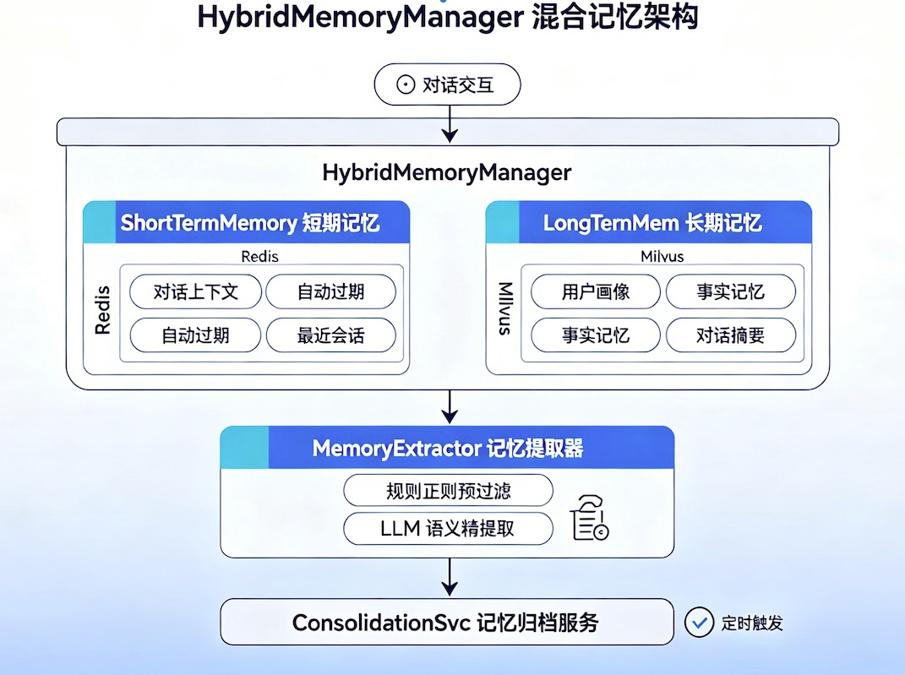
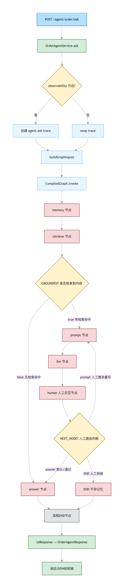

# 使用Spring AI Alibaba实现的智能客服

EcommSpringBot 是一个基于 SpringAI Alibaba 的企业级智能客服助手系统，支持用户通过自然语言交互完成订单查询、自动取消、规则问答等操作，融合微服务架构、RAG 技术、Redis 聊天上下文记忆与向量数据库，实现私有化可扩展的智能体服务平台。

## 项目亮点

- 基于 SpringAI Alibaba 实现企业智能体对话能力（支持通义千问/OpenAI）
- 模块化设计：订单服务、中台服务、SSE 方式连接 MCP 服务、RAG 知识库、记忆模块清晰分离
- 支持自然语言查询订单、自动取消订单
- 使用 Milvus 向量数据库构建 RAG 知识库，支持语义检索增强
- 使用 Redis + Milvus 实现多层对话记忆（短期 / 长期）

## 模块结构

```
EcommSpringBot/
├── mall-order/                       # 核心订单服务（Spring Boot + MySQL）
├── mall-order-cmp-server/            # CMP 中台服务（封装订单能力）
├── mall-order-cmp_sso-client/        # 提供 Controller 接口 + Redis 聊天上下文支持
├── mall-order-es-rag/                # ES 向量知识库模块（退换货规则文档 → ES 向量）
├── mall-order-graph-server/          # MCP 图计算服务（基于 Spring AI Alibaba）
├── mall-order-milvus-rag/            # Milvus RAG 检索 + rerank + 问答（端口 8086）
├── mall-order-agent/                 # 订单 Agent（StateGraph 编排，端口 8087）
├── mall-order-milvus-memory/         # 多层对话记忆模块（Redis 短期 + Milvus 长期）
└── README.md
```

## 功能特性

### 1. 自然语言操作订单服务
- 用户可使用自然语言对话，如：
  - "我想查询 用户USER1005 的订单"
  - "帮我取消用户USER1005 的订单"
- 通过 Spring AI Alibaba Function Calling 自动匹配接口并调用 mall-order 服务完成。

### 2. SSE 实时回复 + Redis 上下文记忆
- 使用 SSE（Server-Sent Events）建立流式连接
- 基于 Redis 实现用户对话上下文记忆
- 支持连续上下文查询、简洁自然的人机交互体验

### 3. 向量检索增强（RAG）
- 使用 text-embedding-v2 模型生成向量，存入 Milvus 向量数据库
- 支持 PDF 文档导入、按章节分块、语义搜索
- 集成 **qwen3-rerank** 精排，提升检索相关性
- 提供 **`/ask` 问答接口**：检索 + rerank + Qwen 生成自然语言回答
- 用户提问如「婚假有多少天？」可自动匹配 HR 手册并给出答案

### 4. 多层对话记忆
- 短期记忆（Redis）：当前对话上下文，自动过期淘汰
- 长期记忆（Milvus）：用户画像、事实、对话摘要持久化
- 规则+LLM 两阶段提取：从对话中自动提取值得长期记录的信息

---

## mall-order-milvus-rag — RAG 向量检索与问答模块

基于 **Spring AI + Milvus + DashScope** 的企业知识库 RAG 服务（端口 **8086**）。支持 PDF 导入、按章节分块、向量检索、Qwen 重排序、LLM 问答生成。

### 技术架构

```
                    ┌─────────────────────────────────────────┐
  用户问题 ────────► │  POST /ask  或  POST /search           │
                    └──────────────────┬──────────────────────┘
                                       │
         ┌─────────────────────────────▼─────────────────────────────┐
         │  1. Retrieve   Milvus 向量召回（COSINE，可 metadata 过滤）   │
         │  2. Rerank     qwen3-rerank 精排（可选）                     │
         │  3. Generate   qwen-plus 生成回答（仅 /ask）                 │
         └─────────────────────────────────────────────────────────────┘
                                       │
              DashScope text-embedding-v2（1536 维） + qwen3-rerank + qwen-plus
```

**入库流程：**

```
PDF/文本 → PdfTextCleaner 清洗 → 按「第X章」预切分 → Token 分块（250 token）
         → text-embedding-v2 → Milvus Collection（mall_rag_v2）
```

### 内置知识库

模块内置 7 份 PDF（`src/main/resources/data/`），metadata 在 `rag.yml` 的 `rag.catalog` 中维护：

| 文档 | department | role（权限过滤） |
|------|------------|------------------|
| 01_HR员工手册.pdf | HR | hr |
| 02_财务制度.pdf | Finance | finance |
| 03_电商订单规则.pdf | Operations | public |
| 04_物流规则.pdf | Logistics | public |
| 05_客服处理手册.pdf | CustomerService | customer_service |
| 06_技术开发规范.pdf | Engineering | developer |
| 07_AI_Agent运维手册.pdf | Platform | admin |

### 配置文件

| 文件 | 内容 |
|------|------|
| `application.yml` | 端口、DashScope API Key、Embedding/Chat 模型 |
| `rag.yml` | Milvus 连接、分块参数、rerank、ask、文档 catalog |

```yaml
# application.yml（节选）
spring:
  config:
    import: classpath:rag.yml
  ai:
    openai:
      api-key: ${DASHSCOPE_API_KEY}
      base-url: https://dashscope.aliyuncs.com/compatible-mode
      embedding:
        options:
          model: text-embedding-v2
      chat:
        options:
          model: qwen-plus
          temperature: 0.3

# rag.yml（节选）
rag:
  chunk:
    chunk-size: 250
    min-chunk-size-chars: 80
  rerank:
    enabled: true
    model: qwen3-rerank
    candidate-multiplier: 3
  ask:
    model: qwen-plus
    context-top-k: 5
  catalog:
    - filename: 01_HR员工手册.pdf
      department: HR
      role: hr
      version: "3.2"
```

Milvus Collection 名：**`mall_rag_v2`**（自定义 Schema，含 `source / department / role / version / create_time` 标量字段，支持过滤）。

### REST API（端口 8086）

#### 文档管理

| 端点 | 方法 | 说明 |
|------|------|------|
| `/vector/milvus/health` | GET | 健康检查 |
| `/vector/milvus/documents` | POST | 添加单条文本 |
| `/vector/milvus/documents/batch` | POST | 批量添加文本 |
| `/vector/milvus/documents/pdf` | POST | 上传单个 PDF（按 catalog 自动匹配 metadata） |
| `/vector/milvus/documents/pdf/batch` | POST | 批量上传 PDF |
| `/vector/milvus/documents/import-local` | POST | 一键导入 `classpath:data/*.pdf` |
| `/vector/milvus/stats` | GET | 服务状态 |

#### 检索与问答

| 端点 | 方法 | 说明 |
|------|------|------|
| `/vector/milvus/search` | POST | 向量检索 + rerank（返回 chunk 列表） |
| `/vector/milvus/search` | GET | 简易检索（`?q=...&topK=5`） |
| `/vector/milvus/ask` | POST | **RAG 问答**（检索 + rerank + Qwen 生成答案） |

### 快速上手

```bash
# 1. 设置 API Key
export DASHSCOPE_API_KEY=sk-xxx

# 2. 启动 Milvus（默认 localhost:19530）后启动服务
cd mall-order-milvus-rag && mvn spring-boot:run

# 3. 一键导入内置 7 份 PDF
curl -X POST http://localhost:8086/vector/milvus/documents/import-local

# 4. RAG 问答
curl -X POST http://localhost:8086/vector/milvus/ask \
  -H "Content-Type: application/json" \
  -d '{
    "query": "婚假有多少天？",
    "topK": 5,
    "similarityThreshold": 0.2,
    "roleFilter": "hr",
    "enableRerank": true,
    "rerankMinScore": 0.1
  }'
```

### 检索请求参数（`/search` 与 `/ask` 共用）

| 参数 | 类型 | 说明 |
|------|------|------|
| `query` | string | 用户问题（必填） |
| `topK` | int | 最终返回条数，默认 5 |
| `similarityThreshold` | double | 向量召回阈值（0~1），默认 0.0 |
| `roleFilter` | string | 按权限角色过滤，如 `hr`、`customer_service` |
| `departmentFilter` | string | 按部门过滤 |
| `sourceFilter` | string | 按 PDF 文件名过滤 |
| `enableRerank` | boolean | 是否启用 qwen3-rerank，默认 true |
| `recallTopK` | int | Milvus 召回数，默认 `topK × candidateMultiplier` |
| `rerankTopN` | int | rerank 返回数，默认等于 topK |
| `rerankMinScore` | double | rerank 最低分（0~1） |

### 返回字段说明

**`/search` 单条 hit：**

| 字段 | 说明 |
|------|------|
| `score` | 主分数（rerank 启用时为 rerank 分） |
| `vectorScore` | Milvus 余弦相似度（通常 0.3~0.5） |
| `rerankScore` | qwen3-rerank 相关性（0~1，更适合设阈值） |
| `metadata.source` | 来源 PDF 文件名 |

**`/ask` 响应：**

| 字段 | 说明 |
|------|------|
| `answer` | Qwen 生成的自然语言回答 |
| `grounded` | 是否基于知识库片段（false = 未检索到资料） |
| `retrieval` | 完整检索结果（含 hits，便于展示引用） |

### 文档分块策略

1. **PDF 清洗**（`PdfTextCleaner`）：去除排版噪声、在章/条/句末插入换行
2. **按章预切分**（`ChapterTextSplitter`）：按「第X章」切段，避免 chunk 跨章节
3. **Token 分块**（`TokenTextSplitter`）：每章内再切，默认 **250 token**，`minChunkSizeChars=80`

> 修改分块参数后需重新执行 `import-local` 或重新上传 PDF，旧向量不会自动更新。

### 核心依赖

| 组件 | 说明 |
|------|------|
| `spring-ai-starter-vector-store-milvus` | Milvus 向量存储 |
| `milvus-sdk-java` 2.5.4 | Milvus 低层 SDK（自定义 Schema） |
| `spring-ai-starter-model-openai` | Chat 模型（DashScope 兼容模式） |
| `spring-ai-autoconfigure-model-openai` | Embedding 模型 |
| `spring-ai-pdf-document-reader` | PDF 解析 |

### 注意事项

- 环境变量 **`DASHSCOPE_API_KEY`** 必填（Embedding + Rerank + Chat 共用）
- text-embedding-v2 固定 **1536 维**，与 Milvus 集合维度一致
- 向量 score 与 rerank score **尺度不同**：召回阶段 threshold 宜设 0.2~0.3，rerank 阶段宜设 0.3~0.5
- 新增文档：在 `rag.yml` 的 `catalog` 添加条目 + 放入 `data/` 目录，再调用导入接口

---

## mall-order-milvus-memory — 多层对话记忆模块

实现短期（Redis）+ 长期（Milvus）多层对话记忆系统，并支持规则+LLM 两阶段记忆提取。

### 技术架构

```
对话交互
    │
    ▼
┌─────────────────────────────────────────┐
│  HybridMemoryManager                    │
│  ┌──────────────────┐ ┌──────────────┐ │
│  │ ShortTermMemory  │ │ LongTermMem  │ │
│  │ (Redis)          │ │ (Milvus)     │ │
│  │ 对话上下文        │ │ 用户画像      │ │
│  │ 自动过期         │ │ 事实记忆      │ │
│  │                  │ │ 对话摘要      │ │
│  └──────┬───────────┘ └──────┬───────┘ │
│         │                    │         │
│         ▼                    │         │
│  ┌───────────────────┐       │         │
│  │ MemoryExtractor   │       │         │
│  │ 规则正则预过滤      │       │         │
│  │ → LLM 语义精提取   │───────┘         │
│  └───────────────────┘                  │
│         ▲                              │
│  ┌───────────────────┐                  │
│  │ ConsolidationSvc  │ 定时触发          │
│  └───────────────────┘                  │
└─────────────────────────────────────────┘
```

### 三层记忆结构

| 层级 | 存储 | 集合/介质 | 生命周期 | 说明 |
|------|------|-----------|----------|------|
| 短期 | Redis | `RedisChatMemory` | 1 小时 | 当前对话原始消息，自动淘汰最旧 |
| 长期-画像 | Milvus | `memory_user_profile` | 持久 | 用户偏好、角色、习惯等 |
| 长期-事实 | Milvus | `memory_fact` | 持久 | 业务规则、客观信息 |
| 长期-摘要 | Milvus | `memory_summary` | 持久 | 对话高层概括 |

### 记忆提取策略（两阶段）

**阶段一 — 规则预过滤**：正则表达式匹配常见模式
- 偏好表达：`我喜欢XX`、`我不想XX`、`叫我XX` 等
- 事实表达：`规则是XX`、`不支持XX`、`需要XX` 等
- 人物画像：`我是XX`、`我的职位XX` 等

**阶段二 — LLM 精提取**：将候选文本传给 LLM，输出结构化 JSON

```json
{
  "memories": [
    {"type": "USER_PROFILE", "content": "用户是一名电商运营人员"},
    {"type": "FACT", "content": "退货需要在签收后7天内申请"},
    {"type": "SUMMARY", "content": "用户询问了退货政策"}
  ]
}
```

### 自动合并机制

1. 短期记忆消息数达到 `consolidation-threshold`（默认 20）时标记可合并
2. 定时任务（默认每 5 分钟）读取短期记忆内容
3. `MemoryExtractor` 提取记忆 → `EmbeddingModel` 生成向量 → 存入 Milvus

### 配置

```yaml
memory:
  enabled: true
  user-id: default_user
  conversation-id: default_conversation
  consolidation-threshold: 20

  short-term:
    max-size: 20
    key-prefix: memory:short:
    ttl-seconds: 3600

  long-term:
    dimension: 1536
    milvus:
      host: localhost
      port: 19530

  extractor:
    enabled: true
    model: qwen-max

  consolidation:
    enabled: true
    interval-ms: 300000
```

### 使用方式

在其他模块中引入依赖即可自动装配：

```xml
<dependency>
    <groupId>com.example</groupId>
    <artifactId>mall-order-milvus-memory</artifactId>
    <version>0.0.1-SNAPSHOT</version>
</dependency>
```

注入 `HybridMemoryManager` 使用：

```java
@Autowired
private HybridMemoryManager hybridMemoryManager;

// 记录对话
hybridMemoryManager.addExchange("用户消息", "助手回复");

// 构建检索上下文
String context = hybridMemoryManager.buildContext(queryEmbedding);

// 手动触发合并
memoryConsolidationService.consolidate();
```

---

## 快速启动

### 前提条件

- JDK 17+
- Maven 3.9+
- Redis
- MySQL
- Milvus 向量数据库
- DashScope API Key（环境变量 `DASHSCOPE_API_KEY`）

### 启动顺序

```bash
# 启动 mall-order 服务
cd mall-order && mvn spring-boot:run

# 启动 mall-order-cmp-server
cd ../mall-order-cmp-server && mvn spring-boot:run

# 启动 sso-client 接口层（含AI智能体接口）
cd ../mall-order-cmp_sso-client && mvn spring-boot:run

# 启动 es-rag 服务（用于 ES 知识库管理）
cd ../mall-order-es-rag && mvn spring-boot:run

# 启动 milvus-rag 服务（Milvus 向量 RAG，端口 8086）
cd ../mall-order-milvus-rag && mvn spring-boot:run
```

> **milvus-memory 为库模块**，无需独立启动，引入依赖后随宿主应用自动装配。

### 共同依赖

| 依赖 | 用途 | RAG | Memory |
|------|------|-----|--------|
| DashScope text-embedding-v2 | 文本向量化 | 文档入库/检索 | 记忆存储 |
| DashScope qwen3-rerank | 检索精排 | `/search`、`/ask` | — |
| DashScope qwen-plus | 问答生成 | `/ask` | 记忆提取 |
| Milvus 向量数据库 | 向量存储与检索 | 文档块（mall_rag_v2） | 长期记忆 |
| Spring AI 1.1.0 | AI 抽象层 | vector store / chat | embedding/chat |
| Java 17 + Spring Boot 3.5.7 | 运行环境 | 通用 | 通用 |

---

## mall-order-agent — 订单 Agent（StateGraph 编排）

基于 **Spring AI Alibaba Graph** 的订单问答 Agent（端口 **8087**）。通过 `StateGraph` 将 Memory、Retrieve、Planner、Prompt、LLM、Human、Answer 七个节点串联，对外提供 `POST /agent/order/ask` 接口。

### 技术架构

```
HTTP 层          OrderAgentController（/agent/order/ask）
    ↓
编排入口层        OrderAgentService（组装初始状态、调 Graph、转 Response）
    ↓
Graph 执行层      CompiledGraph.invoke() 按边依次跑节点
    ↓
节点层            planner → actionRunner → prompt → llm → human → answer
    ↓
基础设施          ActionExecutorRegistry / Redis / MySQL / Milvus / RAG / LLM
```

### 完整流程图



### 节点说明

| 节点 | 职责 | 主要读写 |
|------|------|----------|
| `memory` | 加载 Redis 短期历史、MySQL 用户画像、Milvus 长期记忆 | 只读，不写记忆 |
| `planner` | 输出 `ActionDefinition` 动作链 | 写 `plan`、`planStrategy` |
| `actionRunner` | 按 plan 通过 Registry 动态执行 MEMORY/RAG/TOOL | 写记忆、检索、工具结果等 |
| `prompt` | 读取 Planner 结果，PromptBuilder 组装 LLM 输入 | 写 `builtPrompt` |
| `llm` | 调用 ChatClient（qwen-plus）生成回答 | 写 `answer` |
| `human` | 人工审核关口（默认自动放行） | 写 `nextNode` |
| `answer` | 持久化本轮问答到 Redis 短期记忆 | 写 Redis |

### 两条主路径

**路径 1 — 知识库无命中（短路）**

```
ask → planner → actionRunner(含 retrieve 无命中) → answer → END
```

- `grounded = false`，不调 LLM，返回固定「知识库中未找到…」文案
- 仍会在 `answer` 节点写入 Redis 短期记忆

**路径 2 — 知识库有命中（完整 RAG）**

```
ask → planner → actionRunner → prompt → llm → human → answer → END
```

- `grounded = true`，基于检索资料 + 记忆上下文生成回答
- `human` 节点默认无人工反馈时自动路由到 `answer`

**路径 3 — 人工驳回重写（需开启 HITL）**

```
... → llm → human(中断) → [人工 resume + revisedQuery] → planner → actionRunner → prompt → llm → human → answer → END
```

配置 `agent.graph.human-review-enabled: true` 后，在 `human` 节点前中断，等待人工审核。

### 关键状态键（AgentGraphKeys）

| 状态键 | 含义 |
|--------|------|
| `grounded` | 是否有 RAG 检索依据；`retrieve` 后用于条件路由 |
| `answer` | 最终回答（短路时在 retrieve 写入，正常路径在 llm 写入） |
| `nextNode` | `human` 节点输出的路由键（`answer` / `planner` / `END`） |
| `humanFeedback` | 人工审核输入（`approved`、`revisedQuery`） |

### 配置示例

```yaml
agent:
  graph:
    human-review-enabled: false   # 默认关闭人工审核，human 节点自动放行
```

### 启动

```bash
cd mall-order-agent && mvn spring-boot:run
```

依赖：Redis（短期记忆）、Milvus（RAG + 长期记忆）、MySQL（用户画像，可选）、DashScope API Key。

---

## 许可证

本项目基于 Apache 2.0 License 开源，可自由使用、修改与分发。

如果你觉得该项目有价值，欢迎 Star 或 Fork！

📬 联系作者：996766130@qq.com
