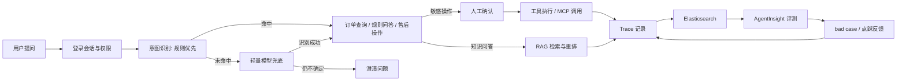

# Java AI Agent 订单平台项目说明

独立设计并完成了一个面向电商订单场景的 Java AI Agent 平台，覆盖订单查询、知识问答、售后操作、人工确认、Trace 观测和 bad case 评测闭环。

## 项目背景

在电商订单场景里，用户问题通常会混在一起：有的只是查订单，有的在问规则，有的要执行退款、退货、取消等敏感操作。

这类问题不能简单交给大模型一次性回答，因为它既要能解释，又要能真正落业务，还要能追踪每一步发生了什么。

## 我解决了什么

- 把“查询、问答、执行”拆成可控的 Agent 流程。
- 对敏感操作加入人工确认，避免误执行。
- 把每次执行的 Trace 落到可检索链路里，便于排查和评测。
- 把用户反馈沉淀成 bad case，形成持续优化闭环。
- 把 RAG 做成完整链路：chunk 切分、七种切分策略、按需路由、检索和重排。

## 核心架构

## 关键设计

1. 意图识别分层

先用规则做快速分类，能直接命中的就不再走模型；规则无法判断时，再交给轻量模型兜底；仍然不清楚的请求，直接要求澄清。

2. 安全优先

退款、退货、取消、改地址等操作必须进入人工确认链路，不允许模型直接越权执行。

3. 业务事实优先

订单状态、退款资格、归属校验这类事实由后端服务决定，大模型只负责解释，不负责改写事实。

4. Trace-first

每次请求都会生成 traceId，并把规划、检索、工具、人工确认等节点写入观测链路，方便在执行端和评测端用同一个 traceId 回看问题。

5. 反馈闭环

用户点踩后会形成 bad case，保留对应的 trace、意图、策略和反馈原因，后续可以用于回归和质量分析。

6. RAG 完整链路

RAG 不是单纯的向量召回，而是从文档 chunk 切分开始就做了分层设计：支持固定切分、滑动窗口、递归、结构感知、语义切分、父子块和内容类型感知七种策略；系统会根据文档类型和场景按需选择切分方式，再进行检索、重排和答案生成。

这样做的好处是，既能保留长文档的结构信息，也能把小片段的召回准确性和答案质量一起拉上来。

## 我负责的内容

- 独立设计整个 Agent 流程和分层策略。
- 完成 Java 侧的 Planner、意图识别、RAG、工具编排、人工确认。
- 完成 Trace、反馈、bad case、评测对接。
- 完成本地启动、联调和演示路径整理。

## 技术栈

Java、Spring Boot、Spring AI Alibaba StateGraph、MySQL、Redis、Milvus、RocketMQ、Elasticsearch、MCP。

## 可演示的 3 个场景

1. 普通订单查询，直接走确定性工具。
2. 规则问答，展示 chunk 切分、RAG 命中、重排和 Trace。
3. 退款或取消，展示人工确认、工具调用和工单落库。

## 

- 为什么意图识别要规则优先？
- 为什么敏感操作不能直接交给模型？
- 你怎么把 trace 和评测串起来？
- 点踩和 bad case 怎么进入后续优化？
- 你的方案如何避免“模型看起来能答，但实际上不稳”？

## 

这份项目内容可以公开，不包含敏感配置、账号信息或内部密钥。

如果要更像正式材料，可以把这份 Markdown 导出成 PDF。
